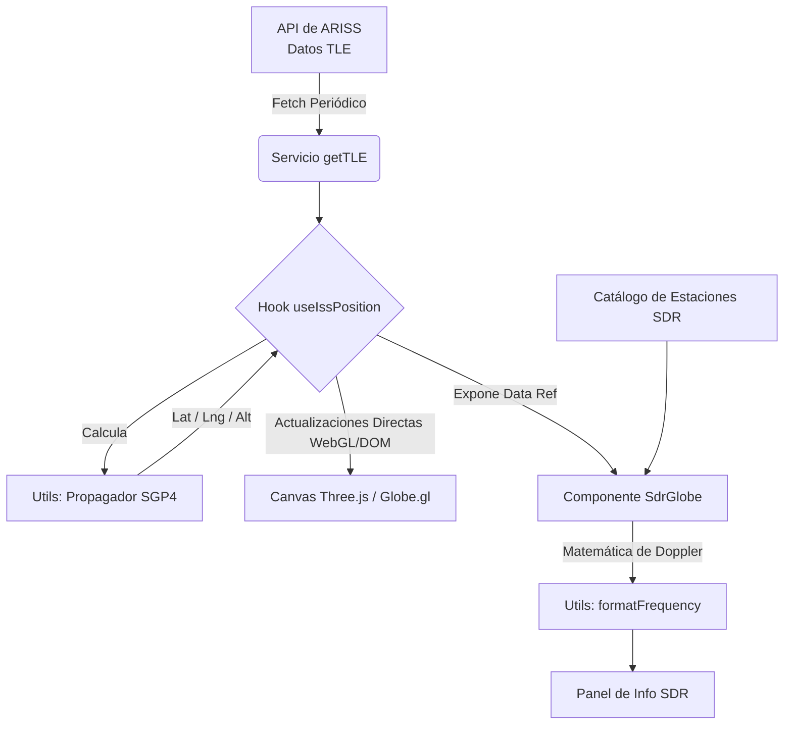

# 🚀 ARISS Tracker
A high-performance 3D web application for real-time tracking of the International Space Station (ISS). It calculates precise orbital propagation using the SGP4 model and simulates Doppler effect shifts for Software Defined Radio (SDR) communications.


---

## 📸 Preview
> 💡 *Espacio reservado para capturas de pantalla, GIF del flujo principal o link al deploy.*

---

## 📖 Sobre el Proyecto
Rastrear la ISS no es solo dibujar un punto en un mapa. Para establecer comunicación de radioaficionados con la ISS (ARISS), los operadores necesitan datos precisos sobre cuándo la estación tiene Línea de Vista (LOS) y cómo el efecto Doppler desplaza la frecuencia de radio debido a las altas velocidades orbitales. 

Este proyecto resuelve ese problema visualizando la órbita de la ISS en 3D y encontrando automáticamente la estación SDR (Software Defined Radio) óptima a nivel global para establecer un enlace de radio, calculando el cambio de frecuencia (downlink) en tiempo real.

---

## ✨ Características Principales
- **🛰️ Rastro Orbital 3D en Tiempo Real:** Visualización fluida a 60fps utilizando Three.js y Globe.gl.
- **🧮 Propagación Orbital SGP4:** Utiliza datos TLE (Two-Line Element) en vivo desde la API de ARISS para calcular coordenadas espaciales exactas.
- **📡 Simulación Dinámica del Efecto Doppler:** Calcula la velocidad radial y los cambios de frecuencia resultantes para comunicaciones de radio.
- **🌍 Optimización de Enlace SDR Automatizada:** Escanea continuamente un catálogo de estaciones SDR globales para identificar el ángulo de elevación más alto y la mejor Línea de Vista.
- **⚡ Arquitectura de Alto Rendimiento:** Evita los ciclos de reconciliación de React para renderizar la posición de la ISS, actualizando directamente WebGL y nodos del DOM para prevenir caída de frames.

---

## 🏗️ Arquitectura y Diagramas
La aplicación sigue una separación limpia de responsabilidades (Clean Architecture), aislando los cálculos matemáticos complejos del renderizado de la interfaz de usuario.



### 📂 Estructura de Carpetas Resumida
- `src/components/` → Bloques de construcción de la UI (Globo, Navbar, Paneles de Info).
- `src/hooks/` → Hooks de React para tareas en segundo plano y manejo de estado complejo (`useIssPosition`).
- `src/services/` → Integraciones con APIs externas (`getTLE.ts`).
- `src/utils/` → Funciones puras para matemáticas complejas, física y procesamiento espacial (`calculateISSPosition`, `formatFrequency`).
- `src/types/` → Interfaces de TypeScript para un tipado estricto.

---

## 🛠️ Tecnologías Utilizadas

### Frontend
- **React (v19):** Librería core para construir la interfaz.
- **TypeScript (v5):** Aplica un tipado estricto, fundamental para manejar los objetos matemáticos y fórmulas físicas.
- **React Router DOM (v7):** Maneja el enrutamiento del lado del cliente para la SPA.
- **CSS Modules:** Enfoque de estilos aislados (scoped) para el diseño de componentes.

### 3D & Visualización
- **Three.js & Globe.gl:** Motor detrás de la visualización del globo 3D interactivo y acelerado por hardware.

### Lógica Core & Matemáticas
- **satellite.js:** Librería principal para parsear datos TLE y ejecutar el modelo de propagación SGP4.

### Infraestructura & Tooling
- **Vite:** Herramienta de construcción (bundler) ultrarrápida, configurada para builds ESNext y Workers.
- **Firebase Hosting:** Configurado para el despliegue de la SPA (`firebase.json`).
- **Oxlint:** Linter de ultra alta velocidad para mantener la calidad del código.

---

## 🧠 Decisiones Técnicas y Highlights (¡CRÍTICO!)

- **🚀 Evitando el Estado de React para Animaciones a 60FPS:** El hook `useIssPosition` calcula la posición de la ISS cada 150ms. Para evitar disparar costosos re-renders de React en todo el árbol de componentes a esta frecuencia, el hook escribe las actualizaciones *directamente* en la instancia de Globe.gl y en refs mutables del DOM. El estado de React solo se reserva para actualizaciones de baja frecuencia (como el refresco del Doppler cada 1 segundo).
- **🌊 Interpolación Lineal (LERP) para Transiciones Fluidas:** Dado que los cálculos de mecánica orbital son pesados, no se ejecutan en cada frame. En su lugar, las posiciones se calculan en intervalos discretos y una función LERP personalizada suaviza las transiciones (latitud, longitud, altitud) entre estos puntos, garantizando un movimiento visual impecable.
- **📐 Geometría Espacial (ECI vs ECEF):** Se implementaron transformaciones complejas para convertir coordenadas desde el marco Inercial Centrado en la Tierra (ECI), utilizado por SGP4, hacia coordenadas geodésicas Centradas en la Tierra y Fijas en la Tierra (ECEF). Esto permite cálculos precisos de distancias euclidianas 3D (rango inclinado o *slant range*) entre la ISS y las estaciones terrestres.
- **📡 Matemática de Desplazamiento Doppler:** En lugar de depender de APIs externas para los cambios Doppler, la aplicación calcula la velocidad radial intrínsecamente al computar la derivada del *slant range* sobre el tiempo, aplicando la ecuación clásica de Doppler para ondas electromagnéticas no relativistas.

---

## 🚀 Instalación y Despliegue

Para ejecutar el tracker localmente, asegúrate de tener Node.js instalado.

```bash
# 1. Clonar el repositorio
git clone <your-repo-url>
cd ARISS-tracker

# 2. Instalar las dependencias
npm install

# 3. Iniciar el servidor de desarrollo Vite
npm run dev

# 4. Compilar para producción
npm run build
```

<details>
<summary><strong>🔥 Despliegue en Firebase</strong></summary>

El proyecto está pre-configurado para Firebase Hosting en el archivo `firebase.json`.

```bash
# Instalar Firebase CLI globalmente
npm install -g firebase-tools

# Iniciar sesión en tu cuenta de Google
firebase login

# Desplegar
firebase deploy --only hosting
```
</details>

---

## 👨‍💻 Autor
**Maximiliano Giménez** - Software Developer
